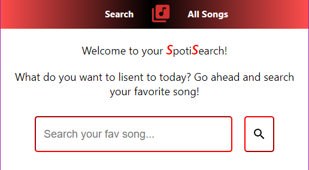
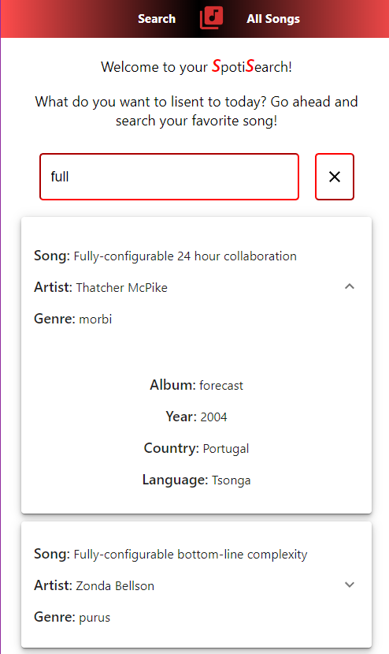
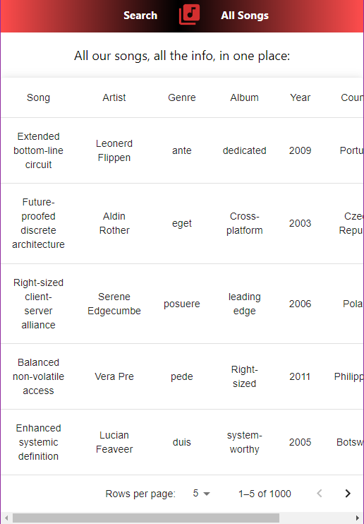

<h1> Welcome to 🎶 SpotiSearch 🔎 </h1>

This is an exercise inspired by the spotify search tool, it is also a technical test that evaluates full-stack developer skills.

✨ This is the font-end repository ✨

To watch the page in action, go to the deploy right here:
⇉   https://spotisearchprueba.netlify.app/    ⇇

<h2> ⭐  Disclaimer ⭐ </h2>

The database was made through the https://www.mockaroo.com/ platform so it doesn't have real information about artists, and music in general.

<h2> The page has two different views: </h2>

The first one is "Search", it allows the user to write an search for a specific song, artis or musical genre and display all the matching results from the database.

The data is displayed on a card that the user can click to expand an read all the information, including, language, country, album and year.

The second one is "All Songs", this view is a table where the user can find all the info consigned on the database in through a pagination explore all the different data

<h2> Dependencies used: </h2>
<ul>
<li>Material UI (Material and Icons)
<li>Axios
<li>react-router-dom
</ul>
